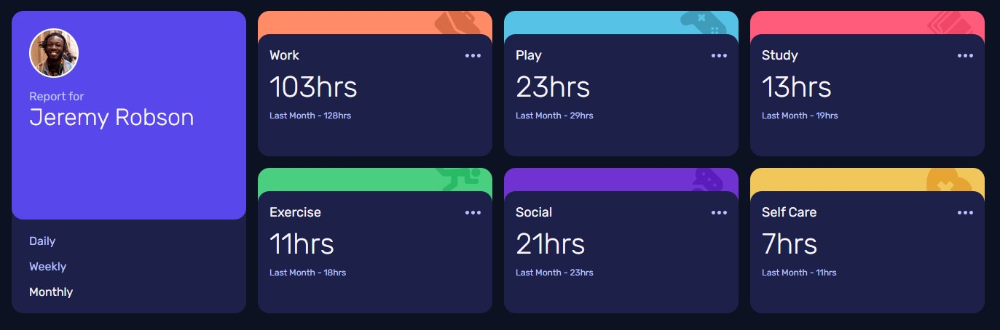

# Frontend Mentor - Time tracking dashboard solution

This is a solution to the [Time tracking dashboard challenge on Frontend Mentor](https://www.frontendmentor.io/challenges/time-tracking-dashboard-UIQ7167Jw). Frontend Mentor challenges help you improve your coding skills by building realistic projects. 

## Table of contents

- [Overview](#overview)
  - [The challenge](#the-challenge)
  - [Screenshot](#screenshot)
  - [Links](#links)
- [My process](#my-process)
  - [Built with](#built-with)
  - [Continued development](#continued-development)
- [Author](#author)

## Overview

### The challenge

Users should be able to:

- View the optimal layout for the site depending on their device's screen size
- See hover states for all interactive elements on the page
- Switch between viewing Daily, Weekly, and Monthly stats

### Screenshot

### Links

- Solution URL: [Github Repo](https://github.com/Allandrow/fem-time-tracking-dashboard)
- Live Site URL: [Live Demo](https://fem-time-tracking-dashboard-ochre.vercel.app/)

## My process

The main goal was to develop in a component driven fashion using Storybook. The ability to create and visualize components in isolation allowed me to concentrate on each part individualy before merging all in a single layout.

### Built with

- Semantic HTML5 markup
- CSS custom properties
- Flexbox
- CSS Grid
- Mobile-first workflow
- [React](https://reactjs.org/) - JS library
- [Storybook](https://storybook.js.org/)

### Continued development

Main aspects to keep working on are :

- CSS Grid
- Customization of Storybook stories

## Author

- Github - [Allandrow](https://github.com/Allandrow)
- Frontend Mentor - [@Allandrow](https://www.frontendmentor.io/profile/Allandrow)
- Linkedin - [cyril-tiger](https://www.linkedin.com/in/cyril-tiger/)

